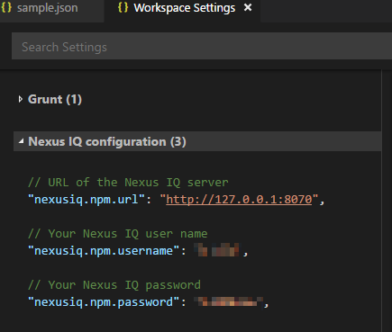

# vscode-nexusiq-npm README

This is an unofficial Visual Studio Code extension for evaluating npm projects with Sonatype Nexus IQ server.

## Features

When you have a workspace (folder) opened with a package.json at the root, execute a command (Ctrl+Shift+P) `Nexus IQ Evaluate`. 

The extension then executes `npm shrinkwrap` to gather the dependency list and submits the name, version pairs them to the evaluation server. The user is notified about how many components have security issues listed.

The results are presented in a JSON format in a new text editor.

## Requirements and settings

Access to a Nexus IQ server instance is required. 

## Extension Settings

This extension uses the following settings:

* `nexusiq.npm.url`: URL to the Nexus IQ server (with http:// included)
* `nexusiq.npm.username`
* `nexusiq.npm.password`

## Release Notes

### 0.0.1

Initial release

**Enjoy!**